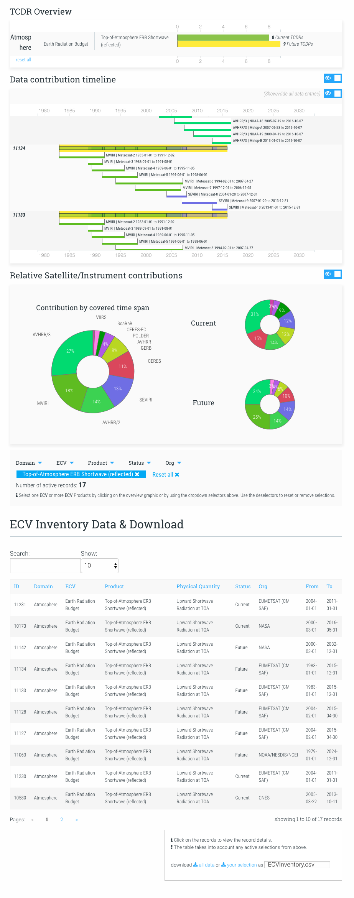

# ECV-Graphics
ECV Interactive Grahics based on data available from http://climatemonitoring.info/ecvinventory/

## Preview


*author: Katia Cardon - dot2dot 
for WGClimate at the request of
ESA's Climate Change Initative http://cci.esa.int/*


## Dependencies

- NodeJS
- HTTP Server

## Get your API key
- obtain your API Key to access the data via ecv_inventory@eumetsat.int or via the website http://climatemonitoring.info

## Installation
```
> npm install
> jspm install
> Configuration file config.js doesn't exist, create it? [yes]: yes
```

## Set your API Key
Open js/components/EcvDashboard.js
and paste your API Key (line 3)

```js
// SET YOUR API KEY HERE //
// GET API ACCESS via ecv_inventory@eumetsat.int or via the website http://climatemonitoring.info
const ApiEcvDb = 'XXXXXXXXXX'
```

## Documentation
Documentation on how the code works is avaialbe from Documentation-ecvgraphics-v1_0.pdf

## Bundling for production
After modifying the code, the code should be bundled again with jspm 

```
> jspm bundle js/main build.js
```

Then add the build.js to the demo.html page.

```html
    <script src="jspm_packages/system.js"></script>
    <script src=“config.js"></script>
    //uncomment line below for development
    <script src="build.js"></script>

    <script>
        System.import('js/main.js');
    </script>
```
